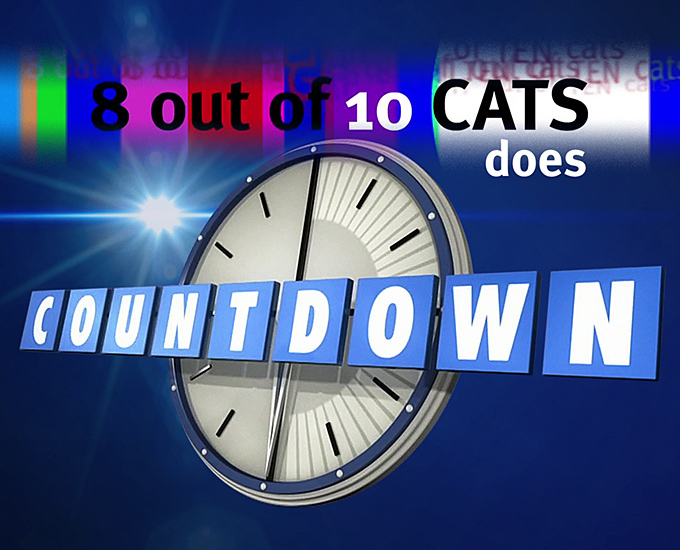
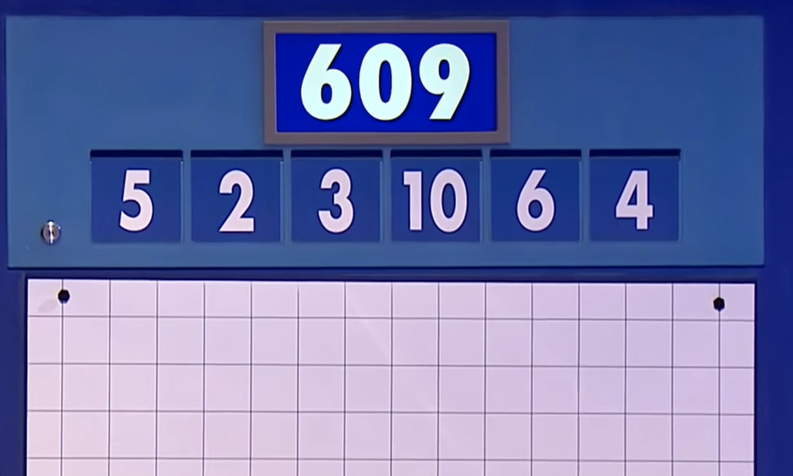

[_Countdown_] is a long running game show on the BBC. It consists of three
types of rounds: letters rounds, numbers rounds, and a final anagram round.
The letters round consists of trying to make the longest word out of a pool
of nine random letters. Similarily, the final round consists of all
contestants trying to figure out a single nine-letter anagram. The numbers
round is the one I focused on for this project.

As an aside, I discovered _Countdown_ via a crossover with [_8 out of 10
Cats_] a
British panel show. It's great combination of comedy banter and game show,
definitely recommend.

The numbers round starts with a contestant choosing six numbers from two
categories: small 1 through 9 and large 25, 50, 75, and 100. At most four
from the large category can be chosen, in which case one of each 25, 50, 75,
and 100 will be chosen. Then a three digit number is chosen at random between
100 and 999. The goal of the round is to create the three digit number from any
subset of the six smaller numbers using addition, subtraction, multiplication,
and division. Contestants are given 30 seconds and the winner is whoever gets
closest within ten: ten points for getting the number, one for nine away.

So for this example the contestant chose all small numbers. And an example
solution to get 609 is $(5 + 2) * ((10 + 4) * 6 + 3)$, or simplifying $7*87$,
quite a tough one to get!

I wanted to make a version of the numbers round that could be used for
playing and practicing. This consisted of two efforts: first creating the game
and then writing a solver.

## Creating the Numbers Round

[_countdown_]: https://en.wikipedia.org/wiki/Countdown_(game_show)
[_8 out of 10 cats_]: https://en.wikipedia.org/wiki/8_Out_of_10_Cats_Does_Countdown
