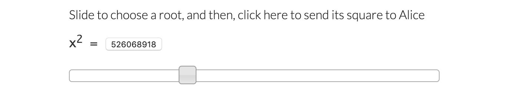

This was a project for a number theory course (MATH 4150) I took at Georgia
Tech. I picked this project and chose to write it in javascript for the browser
because I liked the practical application of deciding a contest between two
parties randomly and securely without any trusted third party. The
implementation runs locally in a single browser using a toy number of bits to
support user-input at each step walking-through the procedure. A practical
application would take place between two browsers using a direct connection,
limiting user-input to initiating procedure, and perhaps re-implemented in
WebAssembly to support a higher number of bits for the keys to be secure.

## Algorithm

Consider the two parties Bob and Alice.

**1. Alice begins by generating two primes: `p` and `q`.**

Ideally these primes would be large enough to be secure prime factors but for
this implementation it defaults to five digits.

**2. Alice sends Bob the product of the two primes: `n = pq`.**

**3. Bob then choses a number `r`, less than `n` to use as a square root mod
`n`.**

I gathered this input via a slider for free entropy.



**4. Bob then squares `r`, `r * r` mod `n` = `s` and sends `s` to Alice.**

At this point, Alice can use the knowledge of `n`'s prime factors `p` and `q` to
find all possible square roots of `s` mod `n` using [Cipolla's
algorithm][cipolla] Since `n` has two prime factors there will be four square
roots, two of which are negations of each other. This follows from the [Chinese
remainder theorem]. For looking up further on this `s` here is a [quadratic
residue].

[cipolla]: https://en.wikipedia.org/wiki/Cipolla%27s_algorithm
[quadratic residue]: https://en.wikipedia.org/wiki/Quadratic_residue
[chinese remainder theorem]:
  https://en.wikipedia.org/wiki/Chinese_remainder_theorem

**5. Alice solves `x * x = s mod n` for roots `a, -a, b, -b`.**

At this point, Alice does not know which of `a` or `b` is the root `r` that Bob
used to generate `s`.

**6. Alice sends one of the four roots to Bob.**


Since Alice doesn't know which root was Bob's original root there's a 50/50
chance the root sent to Bob will be either the same one or its negation. In that
case, Bob doesn't receive any new info. **This means Alice wins the coin flip.**

Otherwise if Alice sends a root that Bob doesn't know about, Bob now has all
four roots and is able to derive both of `n`'s prime factors `p` and `q`. **Bob
then sends `p` and `q` back to Alice to prove it and that means Bob wins the
coin flip.**

## Implementation

The substantive parts of the implementation are to complete steps 1 and 5:
generating the primes factors and solving for the square roots. I left the
jQuery UI-wiring code in the [`index.html`] and pulled the more complex out to a
separate [js file].

[`index.html`]: https://github.com/devm33/fair-coin-flip/blob/master/index.html
[js file]:
  https://github.com/devm33/fair-coin-flip/blob/master/fair-coin-flip.js

Generating the prime factors was the most computationally expensive step of the
procedure. I settled on an approximate algorithm to achieve reasonable
performance. First, I used the [Sieve of Eratosthenes] to create a list of
primes less than a million. I then used that list to do a first pass over a
randomly generated number to check if it is a composite. Then, I used the
[Miller-Rabin test] to decide if the number is prime. This is the overall
procedure:

```js
function generate_prime_of_length(n) {
  /* Returns a random prime' number that has n digits
   * where prime' means probably prime, uses Miller-Rabin
   */
  var p;
  while (true) {
    p = random_integer_of_length(n);
    if (!has_small_prime_factor(p) && miller_rabin_test(p, 100)) {
      return p;
    }
  }
}
```

The first step of using the sieve and a small prime list could undoubtedly has
performance improvements, such as reducing use of the modulus operator or
generating a larger prime list offline and storing it. But it was not the
bottleneck of the procedure so I didn't try to optimize it further.

```js
var has_small_prime_factor = (function() {
  /* anonymous function to trap list in scope to generate once */
  var small_prime = find_all_primes_less_than(1e6);
  var len = small_prime.length;
  return function(n) {
    /* Returns true if n has a factor in list of small primes */
    for (var i = 0; i < len; i++) {
      if (n % small_prime[i] === 0) {
        if (n == small_prime[i]) {
          /* quick check in case n is a small prime */
          return false; /* could handle small n better, but small so not necessary */
        }
        return true;
      }
    }
    return false;
  };
})();
```

[sieve of eratosthenes]: https://en.wikipedia.org/wiki/Sieve_of_Eratosthenes
[miller-rabin test]: https://en.wikipedia.org/wiki/Miller–Rabin_primality_test

Performance improvements probably exist in this function. Modulus can be an
expensive call. However, this check was less expensive overall in the generation
of primes, so I didn't try to optimize further.

The Miller-Rabin test on the other hand can take as much time as required for
selected confidence. I went with a hundred iterations for a confidence of
`1/4^100 = 6e-61` that the test returned a false positive.

```js
function miller_rabin_test(n, k) {
  /* Returns false if n is composite and true if n is probably prime
   * with probability 1/4^k
   */
  var ds, d, s, a, x, i, j;
  ds = separate_two_factor(n - 1);
  d = ds[0];
  s = ds[1];
  witness: for (i = 0; i < k; i++) {
    a = random_integer_between(2, n - 2);
    x = modular_power(a, d, n);
    if (x == 1 || x == n - 1) {
      continue witness;
    }
    for (j = 0; j < s - 1; j++) {
      x = (x * x) % n;
      if (x == 1) {
        return false;
      }
      if (x == n - 1) {
        continue witness;
      }
    }
    return false;
  }
  return true;
}
```

The bottleneck of the Miller-Rabin test was the modular power routine which I
also needed for step 5 of solving for the square roots so I spent some time
trying to make that faster. To make the goal clear, here is a

```js
function modular_power(b, k, n) {
  /* Returns b raised to the k in mod n */
  return Math.pow(b, k) % n;
}
```

I started with a less naive approach that better handled how I was using it with
large powers.

```js
function modular_power(b, k, n) {
  /* Returns b raised to the k in mod n */
  var ans = 1;
  for (var i = 0; i < k; i++) {
    ans = ans * b;
    if (ans > n) {
      ans = ans % n;
    }
  }
  return ans;
}
```

However, due to reliance on modulus and multiplication this approach was still
not performant. After researching around I landed on this algorithm from
[yacas](yacas.org)

```js
function modular_power(b, k, n) {
  /* Returns b raised to the k in mod n */
  var p = b,
    j = k,
    r = 1;
  while (j > 0) {
    if ((j & 1) == 1) {
      // j is odd
      r = (r * p) % n;
    }
    p = (p * p) % n;
    j = j >> 1;
  }
  return r;
}
```

To clarify, let's reiterate that in pseudocode:

```
Input: positive integers base, power, and modulus
Note: assume all operations are mod the modulus (ie in Z modulus)
Let result := 1
While exponent > 0
  If exponent is odd then
    result := result * base
  base := base * base
  exponent := integer divide exponent by 2
Return result
```

This reduces the time complexity from O(k) in the second approach to O(log k).
It relies on the observation that the exponent, `e`, represented in binary is:

$$
e = \sum_{i=0}^n a_i 2^i \quad\textrm{where}\quad n = log_2(e)
$$

Therefore the base, `b`, raised to the exponent can be rewritten as:

$$
b^e =  b^{(\sum_{i=0}^n a_i 2^i)} = \prod_{i=0}^{n} b^{a_i} b^{2^i}
$$

Which is what we are calculating in the above pseudocode. When we check if the
exponent is odd at each loop we are checking where $$ a_i $$ is 1 or 0. If
$$ a_i $$ is 1 the exponent (at the ith iteration of the while loop) will be odd
in which case we need to multiply our result by $$ b^{a_i} = b^1 = b $$.
Otherwise if $$ a_i = 0 $$ then $$ b^0 = 1 $$ which doesn't affect the product.
Regardless of whether the exponent is odd at every iteration we need to account
for the $$ b^{2^i} $$ product which happens by progressively squaring the base.

The calculation to solve for the square roots of each prime put this faster
modular exponentiation to good use:

```js
function square_root_modp(a, p) {
  /* Returns a square root of a in mod p, p an odd prime, could be any
   * either root of the forms: x, p-x
   * (assumes a is indeed a quadratic residue)
   * First checks easy case of p=3(4) then uses Cipolla's algorithm:
   * http://people.math.gatech.edu/~mbaker/pdf/cipolla2011.pdf */
  var t, w, i, p2, x, y, x0, y0;
  if (p % 4 == 3) {
    return modular_power(a, Math.floor(p / 4) + 1, p);
  }
  do {
    t = random_integer_between(1, p);
    w = t * t - a;
  } while (jacobi(w, p) == 1);
  p12 = (p + 1) / 2;
  x = t; /* use x,y to track squaring: (t + root(w)) ^ k = x + y root(w) */
  y = 1; /* as such: t + root(w)) ^ k + 1 = xt + yw + (x + yt) root(w) */
  for (i = 1; i < p12; i++) {
    x0 = x * t + y * w;
    y0 = x + y * t;
    x = x0 % p;
    y = y0 % p;
  }
  if (x < 0) {
    x = x + p;
  }
  return x;
}
```
