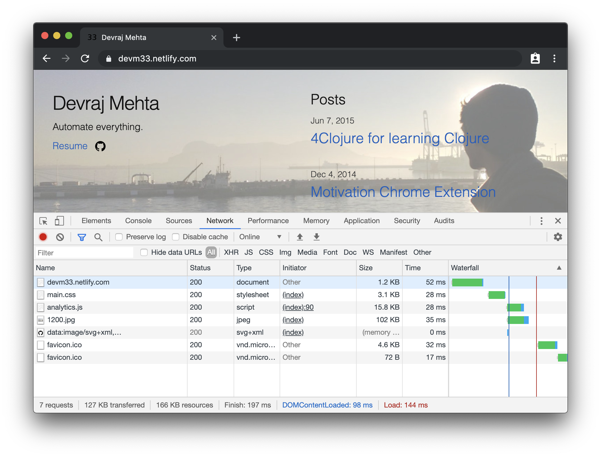

I moved my hosting to Netlify after learning about their git-based workflow
support (also because free!) This meant I could remove the custom git-hook-based
setup I had implemented on my previous host: [commit]. I also took the time to
remove the bash-script post-processing I was doing (e.g. gzipping files). I used
[Netlify services] to replace much of the asset optimization and post-processing
since they offered asset concatenation, minification, and finger-printing. I
also added in [jekyll-assets] to provide some tools within jekyll to handle
assets. For example, adding image dimensions to the generated html, something I
was able to contribute to jekyll-assets: [pull request].

[commit]:
  https://github.com/devm33/devm33/commit/49d9dfa2a6784541943f5936322cf7d506636edd
[netlify services]:
  https://www.netlify.com/blog/2017/11/15/what-build-tools-can-do-for-you/
[jekyll-assets]: https://github.com/envygeeks/jekyll-assets
[pull request]: https://github.com/envygeeks/jekyll-assets/pull/116

Some performance optimizations remained manual however. Such as svg/png/jpeg
optimization including making jpegs progressive and generating responsive image
sizes. I learned a lot from working on those image optimizations using tools
such as [optipng], [svgo], [jpegtran], and of course [imagemagick].

[optipng]: http://optipng.sourceforge.net/
[svgo]: https://github.com/svg/svgo
[jpegtran]: https://jpegclub.org/jpegtran/
[imagemagick]: https://imagemagick.org/

The most important aspect of improving the site's performance is reducing the
total network load. I approached this by reducing unnecessary css and html. I
also used almost no javascript on the site. With a minimalist approach and the
help of Netlify CDN services (Cloudfront) I was able to reduce the total
bandwidth required to under 130KB and get all significant load times to under
500ms - except in case where the initial connection to Netlify could take up to
a second.

