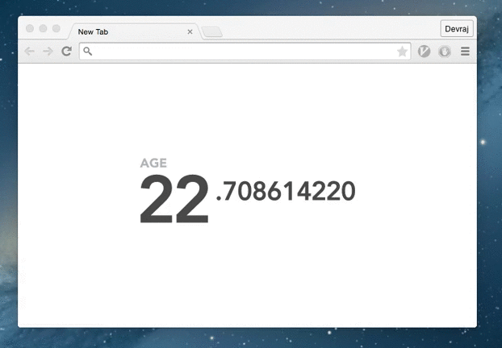
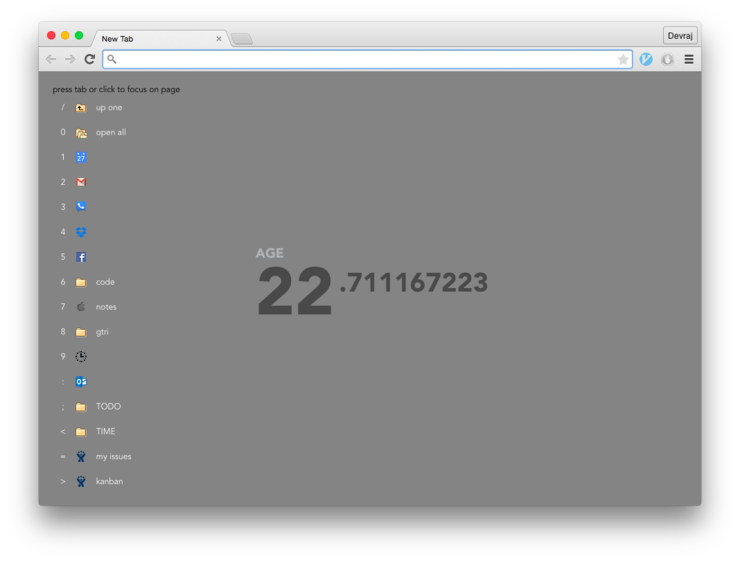

A friend was running [motivation chrome extension][] which replaces the new-tab
page in chrome with a page that displays the user's age to nine decimal places.

Despite how much I liked the original extension implementation I wanted to tweak
the appearance a little. Thanks to the source being on github, I soon had a fork
of the motivation extension and after some css tweaks I had fixed the offset
issue that was bothering me. Of course, once you give a moose a muffin the moose
decides to refactor the backbone to angular, add grunt, and start adding
features.

I had an idea for bookmarks on the new tab page. When you open a new tab you
should be able to access your frequent bookmarks via the keyboard. After
focusing on the new-tab page [^1] pressing the number [^2] of the bookmark opens
it. Going further with inspiration from vim, hitting the space bar and then the
number of a bookmark folder opens each of the folder's contents in new tabs. Of
course, clicking the bookmarks works as expected and middle clicking on a
bookmark folder also opens the folder's contents in new tabs.

I built the bookmarks feature to be separable from the rest of the extension. I
could reuse the bookmarks module for another new tab chrome extension.

For future work, I'm interested in duplicating more of the functionality of the
native bookmarks [^3]. Right now I have completed navigating and deleting. On
the backlog is renaming/editing and rearranging.

[^1]:

  Default focus for new tab page is the url bar. A single tab brings focus to
  the page or more specifically to the first link on the page. I've noticed some
  chrome extension widgets will insert themselves in the focus chain after the
  url bar though, so shift-tab is useful in that case to go backwards through
  the focus chain, i.e. the last link on the page.

[^2]:

  The key for a bookmark will be a number if the bookmark is in the first nine
  bookmarks. After that I use characters in the order defined by character code,
  starting with ':' at 58, '9' is 57.

[^3]:

  At least I can build as much as is possible with the [chrome extension
  bookmarks api][bookmarks-api].

[motivation chrome extension]: https://github.com/maccman/motivation
[bookmarks-api]: https://developer.chrome.com/extensions/bookmarks
