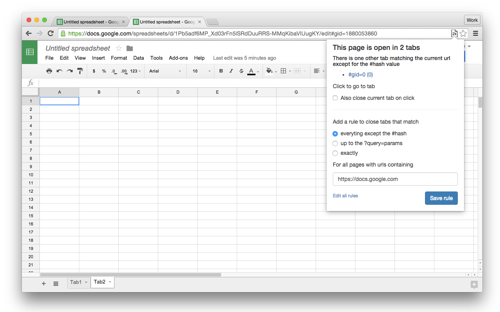
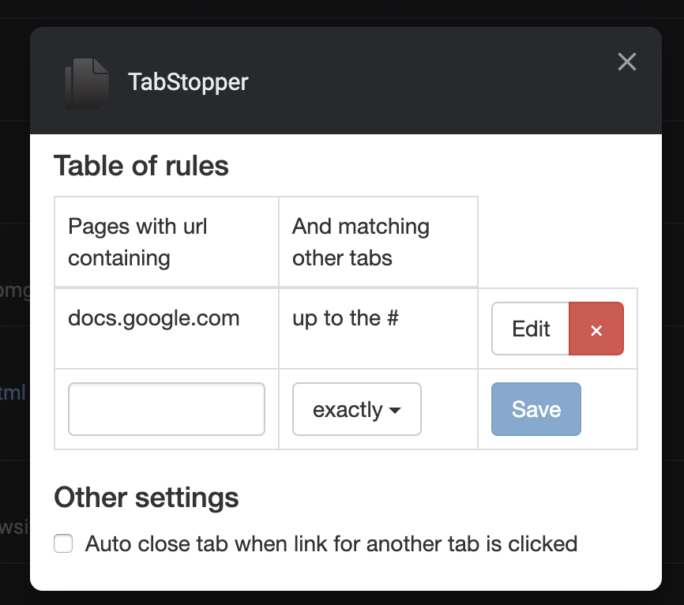

Tabstopper is a chrome extension I built to detect when opening a page that is
already open in an existing tab.

The tricky bits for meeting this goal came around defining when two URLs refer
to the same page. In some cases, the anchor refers to a section within a page,
and thus pages are duplicate even with different anchors. In others cases, with
fancy single page apps the anchor or query params are the sole identifiers for
the page, ignoring them would lead to all pages appearing duplicate.

Unable to solve this identification problem generically I deferred to the user
to define the identification schemes for the pages they use. I used the
extension's `options_ui` to build a table for editing site specific settings.
For ease of use site behavior is also editable from the extension popup with the
context of the given site. This also served as a place to define the action the
extension should take when detecting duplicate pages: whether to close the tab
and navigate to the already open page or more passively display a notification.

