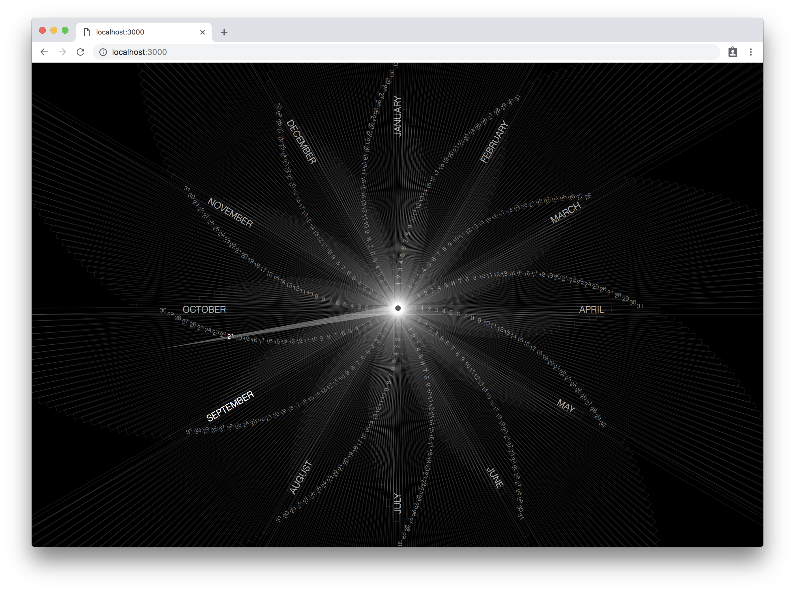
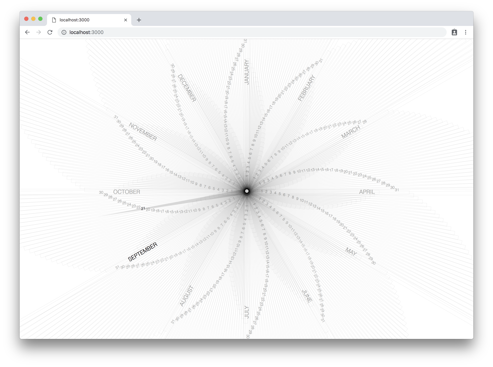

I built this chrome extension as a variant of the [motivation] chrome extension.
Instead of the age ticking by at nine decimal places it shows the current
calendar year in the format of an analog clock. The intention was to have to
opposite effect, instead of promoting a sense of urgency seeing your age
increase - giving a calming impression from the clock hand moving a day at a
time.

[motivation]: /projects/motivation

I've kept this extension as my new tab page for over a year now and to my
surprise it has not had the calming affect I expected. Instead it often feels
like the clock hand moves faster than expected as the weeks and months fly by.
Perhaps, this is a side-effect of getting older.

I built the extension using React. The date math primarily uses the browser's
`Date` object and some manual inputs. I'm sure there are date math corner cases
I've missed.

The line pattern was an accident from debugging the text positioning using
transparent borders. It made an appealing effect so I kept it.

```css
.day,
.month {
  z-index: 10;
  font-weight: lighter;
  text-transform: uppercase;
  position: absolute;
  width: 100%;
  top: 50%;
  border: 1px solid #ffffff1a;
  vertical-align: middle;
}
```

Later, I added a light mode that inverted all the colors. The small circle in
the center of the clock is a button that switches the mode. I'd like to add a
color mode as well that transitions the color around the clock aligning with
seasons.


