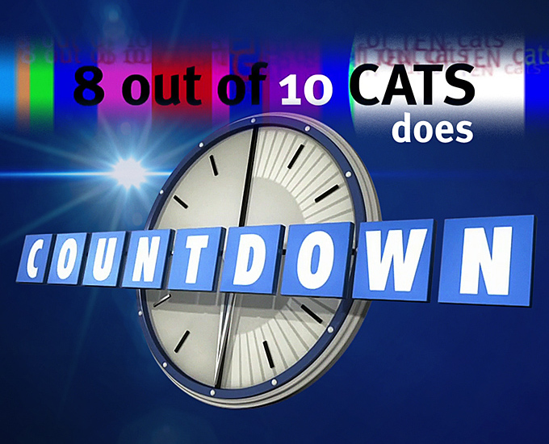
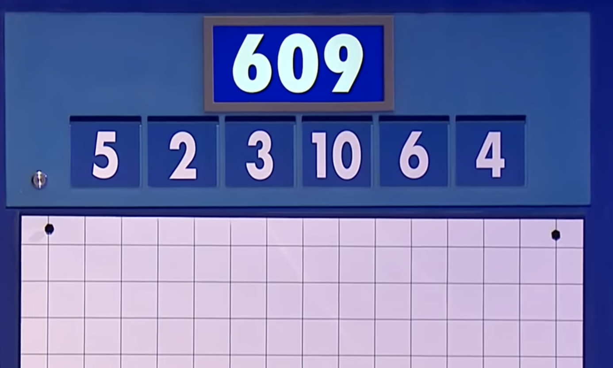
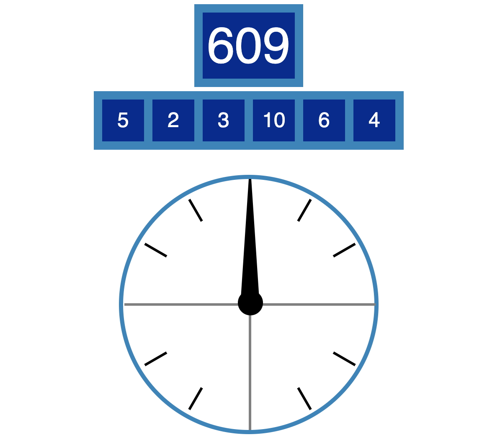
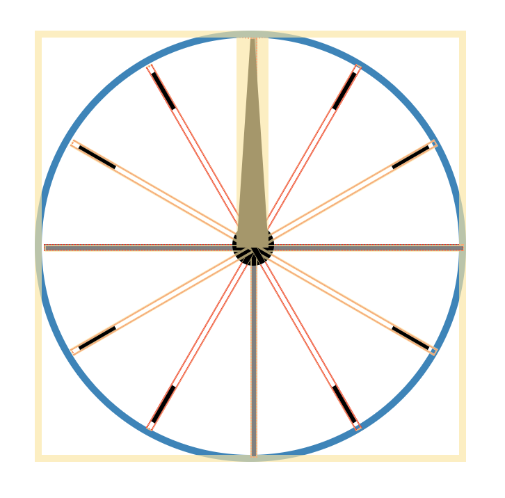

[_Countdown_] is a long running game show on the BBC. It consists of three types
of rounds: letters rounds, numbers rounds, and a final anagram round. The
letters round consists of trying to make the longest word out of a pool of nine
random letters. Similarly, the final round consists of all contestants trying to
figure out a single nine-letter anagram. The numbers round is the one I focused
on for this project.

As an aside, I discovered _Countdown_ via a crossover with [_8 out of 10 Cats_]
a British panel show. It's great combination of comedy banter and game show, I
recommend it.

[_countdown_]: https://en.wikipedia.org/wiki/Countdown_(game_show)
[_8 out of 10 cats_]:
  https://en.wikipedia.org/wiki/8_Out_of_10_Cats_Does_Countdown



The numbers round starts with a contestant choosing six numbers from two
categories: small 1 through 9 and large 25, 50, 75, and 100. They can choose at
most four from the large category, in which case they numbers will include one
of each 25, 50, 75, and 100. Then a three digit number is randomly generated
between 100 and 999. The goal of the round is to create the three digit number
from any subset of the six smaller numbers using addition, subtraction,
multiplication, and division. Contestants have 30 seconds and the winner is
whoever gets closest within ten: ten points for getting the number, one for nine
away.



For this example the contestant chose all small numbers. And an example solution
to get 609 is $(5 + 2) * ((10 + 4) * 6 + 3)$, or simplifying $7*87$, a tough one
to get!

I wanted to make a version of the numbers round for playing and practicing. This
consisted of two efforts: first creating the game and then writing a solver.

## Creating the Numbers Round

I created the Countdown clock and numbers board with css. Most of which was
straightforward borders and rotation, e.g. for the clock ticks.



The clock hand css uses one of my favorite css tricks: a triangle made from
abusing a border.



```css
.Hand {
  width: 3px;
  height: 0;
  margin-left: -10px;
  border-left: 10px solid transparent;
  border-right: 10px solid transparent;
  border-bottom: 150px solid black;
  transform-origin: center bottom;
  transition: transform 1s linear;
}
```

This creates a triangle by way of adding a visible border on one side of a
rectangle with zero width, see
https://css-tricks.com/books/volume-i/how-to-make-a-triangle/

The transition smooths motion of the hand like the one used on the show --
rather than a ticking motion.

## Solving the Numbers Round

To see the alternate solutions and confirm there is a solution when stuck (since
sometimes it's not possible) I needed to write a solver. The search space of the
problem is small since the depth is at most six and the branching factor is less
than four since associative operations led to equal value paths that are
prunable. Still since I wanted all solutions I implemented the solver in a web
worker to keep the main thread free. This improvement was evident in the
animation of the Countdown clock.

Refactoring the search function to a web worker was straightforward with modern
browser support, see https://caniuse.com/#feat=webworkers

The web worker code is in a separate available js file and given an event
listener to receive messages from the application.

<!-- prettier-ignore -->
```js
/* search.js WebWorker API:
 *
 * Request:
 *   goal: number to search for
 *   numbers: array of numbers to use for search
 *
 * Responses:
 *   type: GOAL, path: PathNode
 *   type: CLOSEST, path: PathNode
 *   type: DONE, time: time spent on search
 */

addEventListener("message", function(e) {
  search(e.data.numbers, e.data.goal);
}, false);
```

The application code creates the web worker and adds a corresponding event
listener for receiving messages back from the worker.

```js
this.worker = new Worker("search.js");
this.worker.addEventListener("message", (e) => this.onMessage(e.data));
```

Each thread passes messages with data via a `postMessage` call. For example, the
application code sends the following message to start a search.

```js
this.worker.postMessage({
  numbers: this.props.numbers,
  goal: this.props.goal,
});
```

The web worker search function itself is a standard breadth-first search
implementation to exhaust the solution graph. The visited set key off of
intermediate values to reduce some duplicate paths. The neighbors function is
also defined to avoid states that are duplicates due to associative operations
or trivial operations (multiplying by one or adding zero).

I also added a performance measure to the search function to track what was
happening on the worker thread. Of course then I became obsessed with optimizing
the BFS for every nanosecond. I reduced the search time to under 0.1s, but I'm
sure there's more I could do to go even faster!

<!-- prettier-ignore -->
```js
function search(a, g) {
  var start = performance.now();
  var closest = g;
  var goalFound = false;
  var q = new Queue();
  q.enqueue(new Node(a));
  while(q.hasNext()) {
    getNeighbors(q.dequeue()).forEach(([p,n]) => {
      if(p.value === g) { // Check for goal
        goalFound = true;
        postMessage({ type: 'GOAL', path: p });
        return; // Don't search past goal
      } else if(!goalFound && p.value < g && g - p.value < closest) {
        closest = g - p.value;
        postMessage({ type: 'CLOSEST', path: p });
      }
      if(n.list.length === 1) { // Drop leaves
        return;
      }
      // Enqueue if not seen
      if(!q.hasSeen(n)) {
        q.enqueue(n);
      }
    });
  }
  postMessage({ type: 'DONE', time: (performance.now() - start) / 1000 });
}
```

## Drawing Solutions with D3

Each solution to a numbers problem is a DAG. For example for the solution to the
previous problem: $(5 + 2) * ((10 + 4) * 6 + 3)$, we can draw the graph for this
solution as:

```
       [509]
      /     \
     7   *   87
    / \     /  \
  (5)+(2)  84 + (3)
          /  \
        14 * (6)
       / \
    (10)+(4)
```

Here I've drawn the operators outside of the graph for aesthetics, but to see
this a trie the value of each of the intermediate nodes is instead the operator
and the intermediate number is a consequence of that operator on the two
children.

```
   *  [509]
 /   \
7     87
```

I chose to use the [d3 dendrogram][] to render this graph, rotated to have the
starting numbers at the top coalescing down to the goal number. I used the
[@vx][] library to integrate react and d3. Then, styled the starting numbers to
look like the game tiles.

[d3 dendrogram]: https://www.d3-graph-gallery.com/dendrogram
[@vx]: https://github.com/hshoff/vx


## Follow up

One thing to come back and add here is the ability to specify the game state as
an input. This often comes up when I've seen an interesting numbers round and am
curious what other solutions are possible.

And of course the letters round would be fun to build.
