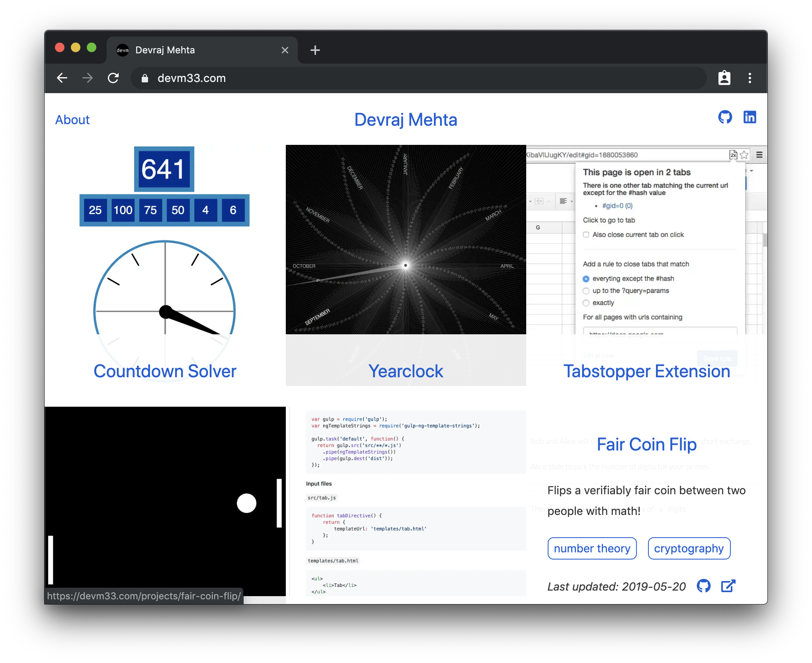
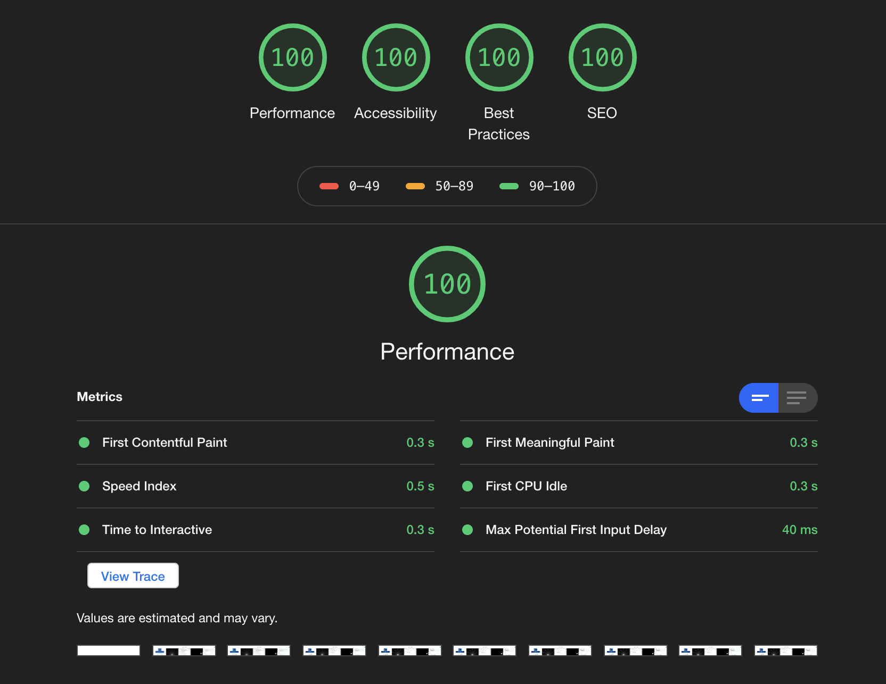
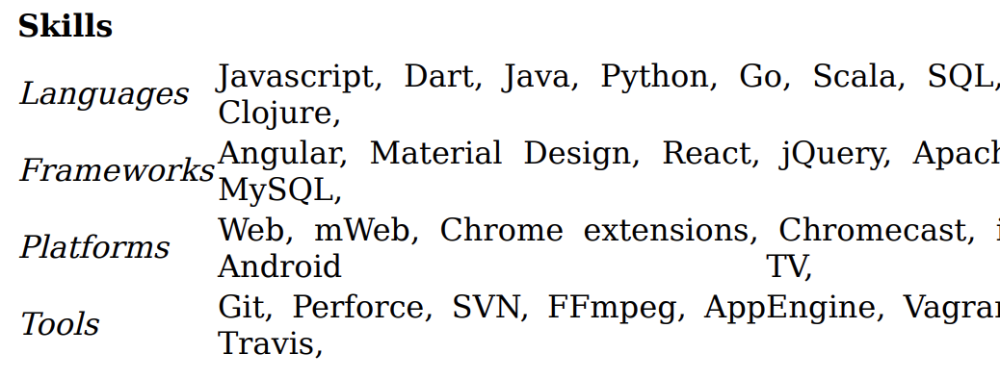

Feeling the perennial urge to learn something new and reset the design, I
replaced my [previous website](../jekyll-netlify) and built a new one using
[Gatsby].



## Gatsby

I chose Gatsby for its performance capability and technology choices. Gatsby
sites use React, Node, and [GraphQL] to create a static website that renders
both server-side and client-side. Server-side rendering is important for first
page load performance: minimizing the amount javascript that needs to run to
render the content right off the bat. Client-side rendering enables cleverness
such as prefetching a page when the user hovers over a link. This can add over
200ms to the perceived performance and was something that I wanted to build on
my previous site for a long time. However, I never got around to because I had
not used javascript on that site for anything critical and limiting it to
vanilla js. With Gatsby this feature came right out of the box with the
[gatsby-link] component.

That brings me to the next reason I choose Gatsby. I wanted to leverage a js
build process on the site and use more tools like React components without
compromising all of the benefits of static site generation. Gatsby met this
ambition well by providing the static site build process with React and GraphQL,
and then, enabling pulling in anything else into the webpack build. For example,
I pulled in [styled-components] and [react-icons]. This made the development
cycle fast and fun.

Gatsby's build pipeline handling of image assets also replaced manipulation I
had been doing manually with a hodgepodge of tools to edit and optimize them.
The [gatsby-image] component handles responsive sizing, lazy-loading, and
multiple image formats in concert with [a series of plugins in the build
pipeline][images].

[gatsby]: https://www.gatsbyjs.org/
[graphql]: https://graphql.org/
[gatsby-link]: https://www.gatsbyjs.org/docs/gatsby-link/
[styled-components]: https://www.styled-components.com/
[react-icons]: https://react-icons.netlify.com/
[gatsby-image]: https://www.gatsbyjs.org/packages/gatsby-image/
[images]: https://www.gatsbyjs.org/docs/working-with-images/

These performance considerations enabled me to get full marks on the
[Lighthouse] performance audit without much work.

[lighthouse]: https://developers.google.com/web/tools/lighthouse/



## GraphQL

Before this project I hadn't had a reason to use GraphQL. I found its organizing
principle of minimizing the data sent over the wire compelling, so I was happy
to try it out. Gatsby uses GraphQL to structure the static build process.
Creating pages such as the project pages generated from markdown operated like
middleware on the GraphQL api. In a life cycle method, first I query the
markdown pages added to GraphQL by the [gatsby-transformer-remark] plugin:

[gatsby-transformer-remark]:
  https://www.gatsbyjs.org/packages/gatsby-transformer-remark/

```js
const projects = await graphql(`
  {
    allMarkdownRemark {
      nodes {
        fields {
          path
          type
        }
        frontmatter {
          tags
        }
      }
    }
  }
`);
```

Then I can operate on the data however I want and write it out to the Gatsby
database using passed in Redux actions (in this case [createPage]):

[createpage]: https://www.gatsbyjs.org/docs/actions/#createPage

```js
const tags = new Set();

// Add project pages.
projects.data.allMarkdownRemark.nodes.forEach((node) => {
  createPage({ path: node.fields.path, component: ProjectTemplate });
  if (node.frontmatter.tags) {
    node.frontmatter.tags.forEach((tag) => tags.add(tag));
  }
});

// Add tag pages.
tags.forEach((tag) =>
  createPage({
    path: `/tag/${tag}/`,
    component: TagTemplate,
    context: { tag },
  })
);
```

Gatsby has a healthy plugin ecosystem so much of the customization work I did
may be replaceable with plugins. However, I appreciated how approachable it was
to code myself enabling fine-grain control over the build process and output.

## Resume

One page where I took advantage of this flexibility was the [resume](/resume)
page. I started with a clean page by not using most of the shared components I
used on the rest of the site. I already had my resume data structured in yaml
from the previous Jekyll site, so I pulled in a plugin [gatsby-transformer-yaml]
to make the data available via GraphQL. Then I generated the resume page with
React, e.g.

[gatsby-transformer-yaml]:
  https://www.gatsbyjs.org/packages/gatsby-transformer-yaml/

```jsx
{
  jobs.map((job) => (
    <Fragment key={job.id}>
      <TrMeta>
        <td>
          <a href={job.uri}>{job.name}</a>
        </td>
        <td>{job.title}</td>
        <td>
          <i>{job.location}</i>
        </td>
        <TdRight>
          {job.start} {job.finish && "– " + job.finish}
        </TdRight>
      </TrMeta>
      <TrDesc>
        <td colSpan="4">{job.description}</td>
      </TrDesc>
    </Fragment>
  ));
}
```

Having control over connecting the yaml to the page enabled me to place all the
files for the resume in the same folder - organizing by purpose instead of type.

```shell
$ ls src/pages/resume
index.jsx  jobs.yml   skills.yml
```

On the previous site I had been generating the pdf version of my resume manually
by printing the resume page to pdf using Chrome. Since I could add anything to
the node build process it was straightforward to automate this with [puppeteer].

[puppeteer]: https://github.com/GoogleChrome/puppeteer

```js
// Generate PDF of resume page
exports.onPostBuild = async () => {
  const browser = await puppeteer.launch();
  const page = await browser.newPage();
  const resumePath = path.join(__dirname, "public/resume/index.html");
  await page.goto(url.pathToFileURL(resumePath));
  await page.pdf({ path: "./public/resume.pdf" });
};
```

It felt great to automate this manual process, however it did cause me to have
to move off of the Netlify build stack. I had been pushing the project to
Netlify to have them build it. It turned out the docker image they use for
building has one font installed: DejaVu, see [this issue I raised][fonts-issue].
DejaVu is not metrics-compatible with Times New Roman and in my opinion doesn't
look as nice. Here you can see the rendering causing issues with the alignment.

[fonts-issue]: https://github.com/netlify/build-image/issues/327



To workaround the Netlify limitation, I moved the build onto Travis and pushed
the built site to Netlify instead of building it on Netlify. Travis had a
similar issue with limited fonts, but they provide sudo access necessary to
install the font before the build. Times New Roman is a bit tricky to install
since you have accept the EULA, but I ended up getting working like so:

```yaml
before_deploy:
  - sudo apt-add-repository multiverse && sudo apt-get update -qq
  - echo ttf-mscorefonts-installer msttcorefonts/accepted-mscorefonts-eula
    select true | sudo debconf-set-selections
  - sudo apt-get install -y ttf-mscorefonts-installer
  - npm run build
```

My travis setup now lints the code, builds the site, and then, deploys to
Netlify using [their js client](https://www.npmjs.com/package/netlify). The
linting consists of spelling checking with [cspell], checking for dead links
with [remark-lint], checking writing style with [write-good], and running
[eslint] on the js and jsx.

[cspell]: https://github.com/streetsidesoftware/cspell
[remark-lint]: https://github.com/davidtheclark/remark-lint-no-dead-urls
[write-good]: https://github.com/btford/write-good
[eslint]: https://eslint.org

## Conclusion

While for the most part Gatsby enables a smooth development I experience I have
had some issues with the hot-reloading, for example changing out with images. I
wish the build process was able to hot-reload changes to the node and config
files, but it doesn't seem that this is feasible with the way it's designed,
discussion on [this issue](https://github.com/gatsbyjs/gatsby/issues/8163).

I plan to add more cross-linking between pages to promote discoverability. I'm
thinking of doing this by re-using the `ProjectGrid` component to show a grid of
related projects at the bottom of each project -- using shared tags to denote
related.
