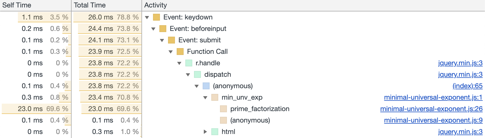

This was a project for a number theory course: MATH 4150 at Georgia Tech. The
goal was to compute the minimal universal exponent for a number, also known as
the [Carmichael function].

[carmichael function]: https://en.wikipedia.org/wiki/Carmichael_function

The minimal universal exponent of a positive integer $$n$$ is the smallest
positive integer $$m$$ such that:

$$
a^m \equiv 1 \pmod n \quad\forall a \in \Z_n^+ \quad\textrm{where}\quad
\textrm{gcd}(a, n) = 1
$$

This Carmichael function, we'll refer to it as $$\lambda(n) = m$$, is
instrumental to the generation of [RSA] keys.

[rsa]: https://en.wikipedia.org/wiki/RSA_(cryptosystem)

In order to compute the function, we have to break down $$n$$ to it's prime
factors. Then by the Chinese Remainder Theorem, we can compute the minimal
universal exponent using the least common multiple of the prime factors'
exponents.

$$
\lambda(n) = \textrm{lcm}(\lambda(p_1^{r_1}, \mathellipsis, \lambda(p_k^{r_k}))
 \quad\textrm{where}\quad n = \prod_{i=1}^kp_i^{r_i}
$$

Then for any prime factor $$ \lambda(p_i^{r_i}) $$ corresponds with [Euler's
totient] for that prime factor.

[euler's totient]: https://en.wikipedia.org/wiki/Euler%27s_totient_function

This means that the majority of the work by far is in factoring $$n$$ since
computing the lcm and Euler's totient for the prime factors is trivial. This is
evident in the Chrome DevTools profile:



For reference, here is the function for computing the minimal universal
exponent:

```js
function min_unv_exp(num) {
  /* Returns a number representing the minimal universal exponent
   * of a positive integer num */

  var e = 1; /* This will be the returned exponent, note: needs to be
    one for the first lcm to work */

  /* Iterate through prime factors, computing lcm of each totient */
  prime_factorization(num).forEach(function (factor) {
    if (factor.p === 2) {
      if (factor.e == 2) {
        e = lcm(e, 2);
      } else if (factor.e > 2) {
        e = lcm(e, Math.pow(2, factor.e - 2));
      }
    } else {
      e = lcm(e, Math.pow(factor.p, factor.e - 1) * (factor.p - 1));
    }
  });

  return e;
}
```

Digging into the prime factorization function the fastest way I could implement
it was using a accumulator approach:

```js
function prime_factorization(n) {
  /* Returns an array of prime factors (in least sorted order)
   * where each factor is an object of the form
   * {'p': 7, 'e': 4}
   * where p is the prime base and e is the exponent for p in the factorization
   */
  var factors = [];
  for (var p = 2; p <= n; p++) {
    var e = 0;
    while (n % p == 0) {
      n = n / p;
      e++;
    }
    if (e > 0) {
      factors.push({ p: p, e: e });
    }
  }
  return factors;
}
```

This relies on the observation that dividing $$n$$ by its the smallest prime
factor $$p_1^{r_1}$$ the smallest number greater than $$p_1$$ that divides
$$n/p_1^{r_1}$$ is necessarily a prime factor of $$n$$.

A quick proof for this follows from contradiction. Let $$p_1^{r_1}$$ be the
factor of $$n$$ such that $$p_1$$ is minimal and $$r_1$$ is maximal.

Now assume $$q > p_1$$ is the next smallest divisor of $$n$$ and $$q$$ is not
prime.

Since $$q$$ is composite, there must exist a prime factor $$\phi < q$$.

$$
\phi|q \,\rarr\, \phi|n
$$

Since $$\phi|n \,\rarr\, \phi > p_1$$ otherwise $$p_1$$ would not be the
smallest prime factor of n.

However, since $$q > \phi > p_1$$ and $$\phi|n$$ that means $$q$$ is not the
next smallest divisor of $$n$$ unless $$q=\phi$$ in which case $$q$$ is prime
breaking our assumption that $$q$$ is composite. &#8718;
